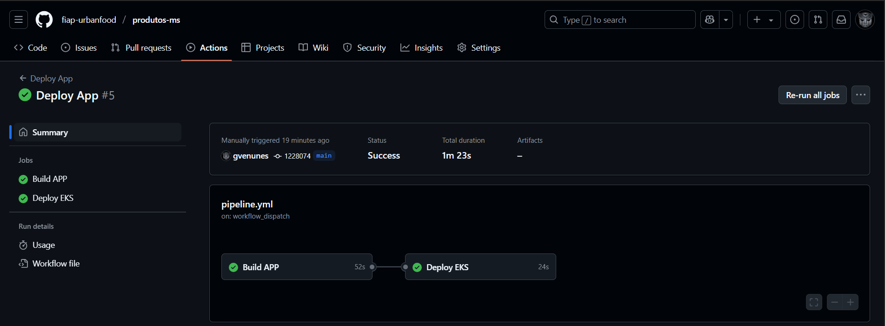
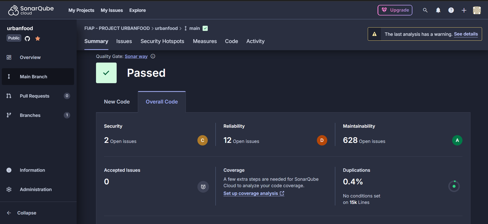
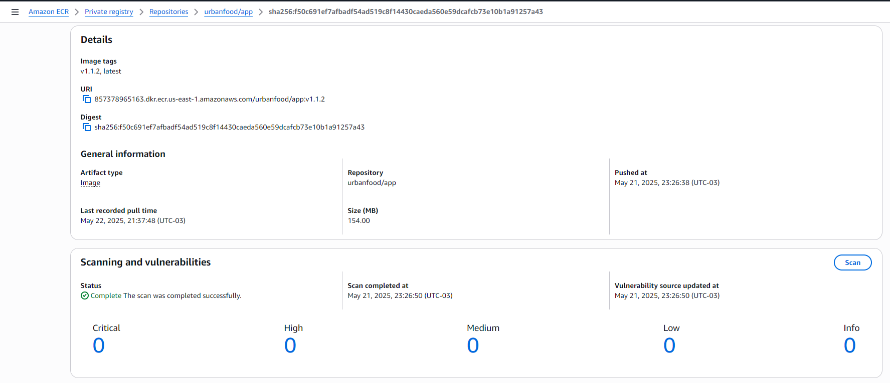
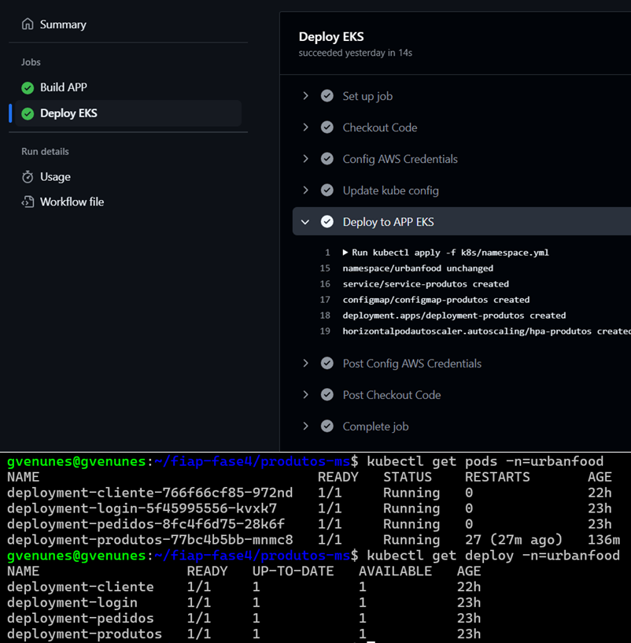

# 💻 Projeto Urban-Food

# produtos-ms
Responsável por gerenciar o catálogo de produtos da aplicação, incluindo operações de criação, atualização, exclusão e consulta. Este serviço centraliza as informações dos produtos e oferece uma API RESTful para que outros serviços possam consumir e manter os dados sempre atualizados e consistentes.

# ###########################################################
# 💻 Deploy via Github Actions

### Executando o CI/CD

Etapas do Pipeline via github actions:

1.1 Build da Applicação:


1.2 Sonar para análise e monitoramento contínuo da qualidade do código.


1.3 Push da Imagem para o ECR.


1.4 Deploy no EKS.


# ###########################################################
# 💻 Deploy via DockerFile

### 1. Preparar o ambiente para gerar o pacote

1.1 Exemplo de como criar as Variáveis de Ambiente..
``` bash
export API_IMAGE_TAG='1.0'
```

1.2 Docker Build na raiz do projeto..
Parametros opcionais no build: --build-arg PYENV="PROD"
``` bash
docker build --no-cache --progress=plain -f devops/Dockerfile -t app-produtos-ms:$API_IMAGE_TAG .
```

1.3 Docker UP..
```
docker run -dit -p 8003:8003 --name=app-produtos-ms app-produtos-ms:$API_IMAGE_TAG
```

1.4 Acesso a API..
```
http://localhost:8003/
```